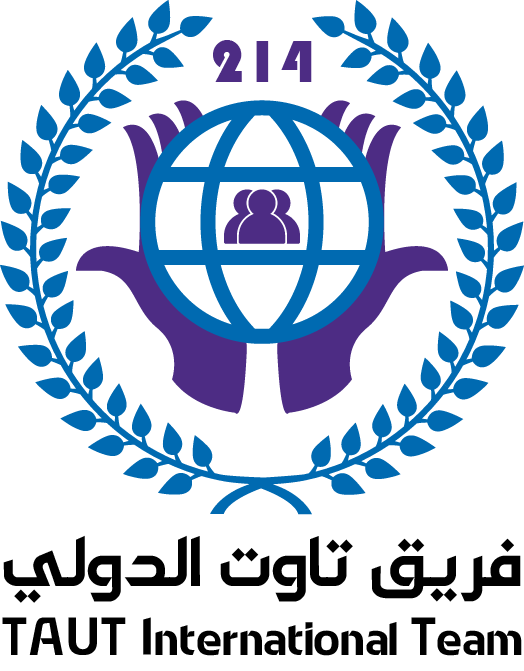

# TAUT International Team Website



## 📌 نبذة عن المشروع

موقع رسمي لفريق **TAUT International Team**، تم تصميمه ليكون واجهة احترافية تعرض هوية الفريق، أعضائه، مشاريع الفريق، سيرفرات الألعاب، والمعرض الخاص بالمجتمع.

الموقع يجمع بين التصميم العصري والأداء العالي مع دعم كامل للأجهزة المختلفة.

---

# ✨ المميزات

## 🏠 الصفحة الرئيسية

- تصميم Hero احترافي.
- عرض نبذة عن الفريق.
- تأثيرات بصرية حديثة.
- أقسام تعريفية عن المشاريع.

---

## 👥 صفحة الفريق

- عرض أعضاء فريق TAUT.
- صور الأعضاء.
- الرتب داخل الفريق.
- وصف مختصر لكل عضو.
- روابط التواصل الاجتماعي:

- Instagram
- TikTok
- Discord
- GitHub
- YouTube

---

## 🎮 صفحة الألعاب

تحتوي على:

### Minecraft

- معلومات السيرفر.
- عنوان الاتصال.
- الإصدار.
- حالة السيرفر.
- عدد اللاعبين.

### MTA:SA

- معلومات السيرفر.
- IP.
- Port.
- نظام عرض الحالة.

---

## 🖼️ المعرض

- عرض صور مشاريع الفريق.
- عرض الفعاليات.
- صور المجتمع.

---

## 📞 صفحة التواصل

تحتوي على:

- نموذج تواصل.
- روابط التواصل الاجتماعي.
- معلومات الفريق.

---

# 🛠️ التقنيات المستخدمة

## Front-End

- HTML5
- CSS3
- JavaScript

## التصميم

- Responsive Design
- CSS Animations
- Modern UI
- Glass Effect
- Gradient Colors

## المكتبات

- Font Awesome Icons
- Google Fonts

---

# 📂 هيكل المشروع

```

TAUT/

│

├── index.html

├── about.html

├── team.html

├── games.html

├── gallery.html

├── contact.html

│

├── assets/

│   │

│   ├── css/

│   │   ├── style.css

│   │   ├── responsive.css

│   │   └── team.css

│   │

│   ├── js/

│   │   ├── script.js

│   │   └── particles.js

│   │

│   └── images/

│       ├── logo.png

│       │

│       ├── team/

│       │   ├── founder.png

│       │   ├── cofounder.png

│       │   ├── developer.png

│       │   ├── designer.png

│       │   ├── moderator.png

│       │   └── support.png

│       │

│       └── games/

│           ├── minecraft.png

│           └── mta.png

└── README.md

````


# 🎨 الألوان المستخدمة

| اللون   | الاستخدام     |
| ------- | ------------- |
| #0E72B8 | اللون الأساسي |
| #7B5BFF | اللون الثانوي |
| #080D18 | الخلفية       |
| #FFFFFF | النصوص        |

---

# 📱 دعم الأجهزة

الموقع يدعم:

✅ أجهزة الكمبيوتر

✅ أجهزة اللابتوب

✅ الأجهزة اللوحية

✅ الهواتف المحمولة

---

# 🤝 المساهمة

نرحب بالمساهمات والتطوير.

```
# 📄 الترخيص

هذا المشروع مخصص لفريق:

```
TAUT International Team
```

جميع الحقوق محفوظة.

---


# ⭐ شكرًا لزيارة مشروع TAUT

نحن نعمل على بناء مجتمع يجمع بين:

🎮 الألعاب

💻 التقنية

🎨 التصميم

🤝 التعاون

```
